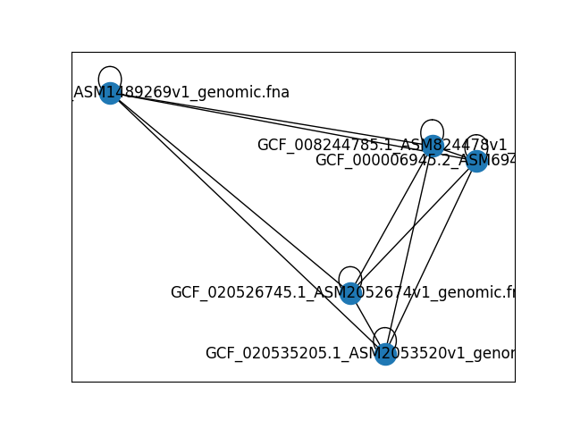

# Alignment free - TP 1

## Binome
Ce TP a été réalisé par:
Maëlys DELOUIS
Soraya REY 

## Objectifs

Le but de ce TP est de réaliser une comparaison entre des génomes en optimisant le temps de calcul et
la place en mémoire. Nous utilisons dans ce but une conversion en kmers binaires de chaque séquence,
puis un calcul de la distance de Jaccard entre chaque paire de séquence pour estimer l'information partagée. 

## Résultats

Nous avons obtenue la matrice de distance suivante entre les séquences:
|Species\Species                              |GCF_000006945.2_ASM694v2_genomic.fna|GCF_008244785.1_ASM824478v1_genomic.fna|GCF_014892695.1_ASM1489269v1_genomic.fna|GCF_020526745.1_ASM2052674v1_genomic.fna|GCF_020535205.1_ASM2053520v1_genomic.fna|
|----------------------------------------|------------------------------------|---------------------------------------|----------------------------------------|----------------------------------------|----------------------------------------|
|GCF_000006945.2_ASM694v2_genomic.fna    |1.0                                 |0.9372829879944679                     |0.0015750639855717137                   |0.01369102282347328                     |0.006857629565735636                    |
|GCF_008244785.1_ASM824478v1_genomic.fna |0.9372829879944679                  |1.0                                    |0.0015815128553124099                   |0.013827493927222058                    |0.006972779039923261                    |
|GCF_014892695.1_ASM1489269v1_genomic.fna|0.0015750639855717137               |0.0015815128553124099                  |1.0                                     |0.0015892331111325275                   |0.0026831658495443528                   |
|GCF_020526745.1_ASM2052674v1_genomic.fna|0.01369102282347328                 |0.013827493927222058                   |0.0015892331111325275                   |1.0                                     |0.18136430081323546                     |
|GCF_020535205.1_ASM2053520v1_genomic.fna|0.006857629565735636                |0.006972779039923261                   |0.0026831658495443528                   |0.18136430081323546                     |1.0                                     |


Nous avons mesuré le temps de calcul et la place en mémoire de l'exécution du main dans deux conditions différentes.

>Sortie de ```/usr/bin/time -v``` sur le main 
```
Command being timed: "python3 main.py"
         Command being timed: "python3 main.py"
        User time (seconds): 183.34
        System time (seconds): 19.01
        Percent of CPU this job got: 94%
        Elapsed (wall clock) time (h:mm:ss or m:ss): 3:34.99
        Average shared text size (kbytes): 0
        Average unshared data size (kbytes): 0
        Average stack size (kbytes): 0
        Average total size (kbytes): 0
        Maximum resident set size (kbytes): 459740
        Average resident set size (kbytes): 0
        Major (requiring I/O) page faults: 0
        Minor (reclaiming a frame) page faults: 1551049
        Voluntary context switches: 0
        Involuntary context switches: 0
        Swaps: 0
        File system inputs: 0
        File system outputs: 0
        Socket messages sent: 0
        Socket messages received: 0
        Signals delivered: 0
        Page size (bytes): 4096
        Exit status: 0
```

>Sortie de ```/usr/bin/time -v``` sur le main SANS CONVERSION EN BINAIRE 
```
 Command being timed: "python3 main.py"
        User time (seconds): 96.51
        System time (seconds): 22.17
        Percent of CPU this job got: 95%
        Elapsed (wall clock) time (h:mm:ss or m:ss): 2:04.73
        Average shared text size (kbytes): 0
        Average unshared data size (kbytes): 0
        Average stack size (kbytes): 0
        Average total size (kbytes): 0
        Maximum resident set size (kbytes): 979624
        Average resident set size (kbytes): 0
        Major (requiring I/O) page faults: 0
        Minor (reclaiming a frame) page faults: 2396400
        Voluntary context switches: 0
        Involuntary context switches: 0
        Swaps: 0
        File system inputs: 0
        File system outputs: 0
        Socket messages sent: 0
        Socket messages received: 0
        Signals delivered: 0
        Page size (bytes): 4096
        Exit status: 0
```

## Analyse
Les distances obtenues entre les espèces sont des indices de Jaccard, une mesure de similarité, c'est-à-dire que plus des espèces sont similaires (ou tout du moins ont des séquences similaires), plus l'indice est élevé. 
Ici on observe une forte similarité entre GCF_000006945.2_ASM694v2_genomic.fna et GCF_008244785.1_ASM824478v1_genomic.fna (~93%), ce qui laisse supposer une proximité des espèces. Il existe aussi une proximité entre GCF_020535205.1_ASM2053520v1_genomic.fna et GCF_020526745.1_ASM2052674v1_genomic.fna, plus faible (~18%). En revanche, le reste des espèces sont très éloignées les unes des autres, ayant des indices systématiquement inférieurs à 0.1.
On peut donc en conclure que, dans cet échantillon, deux génomes correspondent à des espèces très proches (voire la même espèce), deux à des espèces liées et le reste à des espèces éloignées les unes des autres. Ces analyses sont bien récapitulées par le graph suivant, où on retrouve bien deux petits clusters formés des espèces identifiées précédement.


Pour ce qui est des temps de calcul, on observe que la conversion en kmer binaires n'est pas nécesssairement avantageuse par rapport à un simple découpage en kmer non-binaire. En effet, on observe un temps de calcul bien plus élevé dans le second cas. Pour observer ce résultat nous avons simplement effectué la mesure temporelle des kmer non-binaires en effectuant le même procédé mais sans convertir les caractères codant nos séquences en binaire. En revanche, la taille en mémoire est deux fois moindre. On suppose alors que ces mauvaise performances temporelles sont dues à la conversion en binaire de chaque kmer, qui ajoute une complexité supplémentaire à l'algorithme. Ce genre de méthode serait sans doute plus efficace sur des fichiers bien plus gros, où la complexité spatiale impacte bien plus la complexité temporelle. 